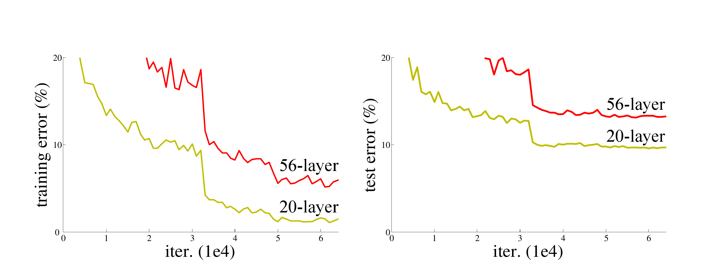
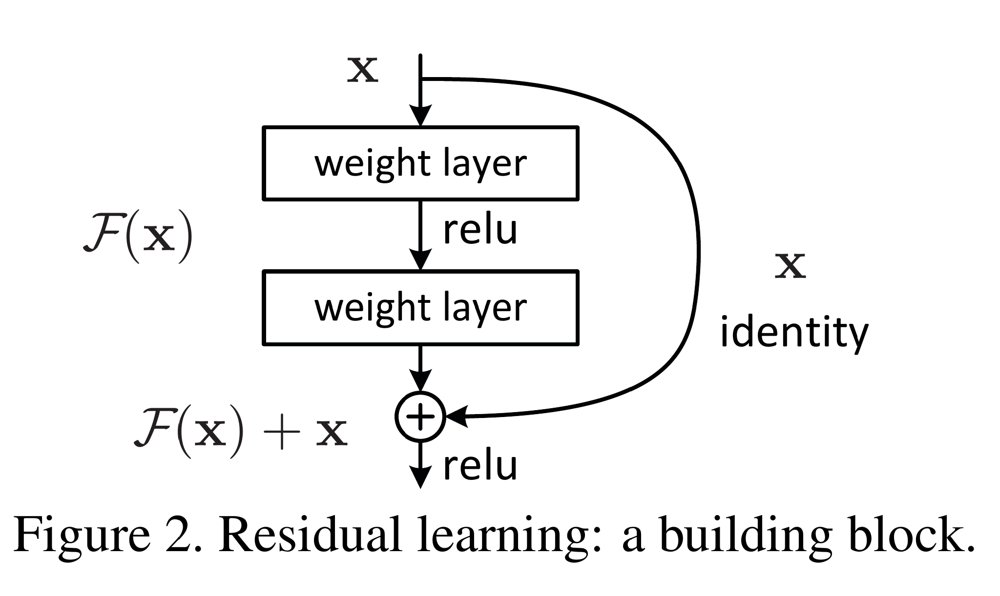
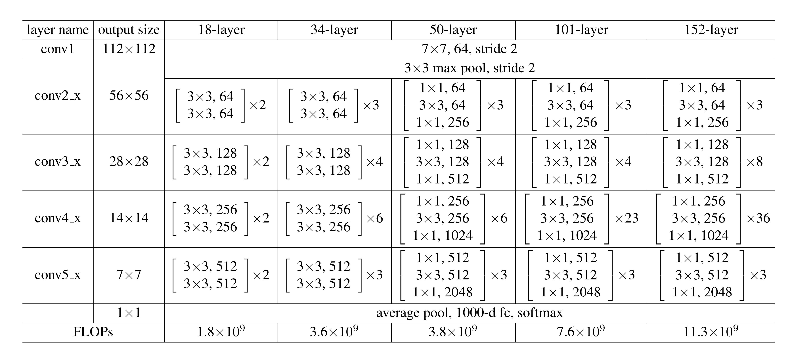

# 贡献
本文最大的贡献就是通过引入残差学习框架，极大的加深了可训练网络的深度。

---

# 引入

## 当前网络发展现状
到目前为止，深度卷积网络已经在图像分类领域做出了一系列重大的突破。一方面深层的网络可以整合低级/中级/高级特征。另一方面对于端到端的多层分类器而言，可以通过控制堆叠层的数量（即网络深度）控制提取出的特征的抽象级别。

近来的研究表明，网络的深度对于模型性能是非常重要的，即更深的网络意味着更大的解空间，也意味着更好的性能。

## 产生的问题
***学习更好的网络和堆叠更多的网络层一样容易吗？（Is learning better networks as easy as stacking more layers?）*** 
网络学习遇到的主要阻碍有梯度消失与梯度爆炸(vanishing/exploding gradients)，但这两个问题已经可以通过正规化初始化(normalized initialization)与中间的正规化层（intermediate normalization layers, 如BN/GBN/GN等等）极大程度上的解决了。

网络学习过程遇到的另一个问题就是网络退化问题（***degradation problem***），也是本文所解决的问题。 

**什么是网络退化** 
随着网络深度的增加，准确度很容易饱和，之后会迅速的下降。但这个退化问题不是由过拟合导致的，当给一个合适深度的模型增加网络层时会导致更大的训练误差[1][2]。图1为典型示例。 
左图为20层plain network和56层plain network的训练误差，右图为对应的测试误差。 

  

## 解决网络退化问题
一种解决方法是通过构建模型实现：新增的网络层为恒等映射，其他的层则从对应的浅层网络拷贝。通过这种方式构建的网络被证明不会生成比对应浅层网络更高的训练误差，但是实验也表明了目前的拟合方法找到不到更优化的解。 

在这篇文章中，通过引入深度残差学习框架解决了网络退化方法。对于只堆叠几层的模块而言，目前为止的办法都是直接去拟合期望的映射。我们把堆叠的这几层看作一个block，记该block的潜在映射为H(x)，我们让堆叠的网络层拟合另外一个映射F(x) = H(x) - x. 那么整个block的映射就被转换为了F（x） + x。我们假设到优化一个残差映射要比拟合原本的，无任何参考的映射要更容易，最终的结果也表明事实是这个样子的。

现在的问题在于怎么在前向传播时实现F（x） + x这个映射。 本文是通过了”short connections“实现这种变换的，如图2所示。可以通过shortcut connections跳过一层或多层。在本论文中，使用了简单的使用了恒等映射，将前一个block的输出和当前block的输出直接相加。 

  

通过在ImageNet上与普通的“plain”网络对比，可以得到两个结论：

1. 深度网络比“plain net”要容易优化的多，当网络层加深时，“plain net”的训练误差会增加
2. 残差网络更容易获得准确度随着网络深度增加的的加成。

---

# 深度残差学习

## 残差学习

残差学习在上文中已进行简单的介绍，总的来说，核心在于：
1. 退化问题表明在使用目前的优化器时，很难通过多个非线性层拟合恒等映射。
2. 让block的参数层拟合H（x）-x 要比拟合无参考的映射简单的多。
3. 如果最优函数更接近恒等映射而不是零映射时，优化器更容易找到相对于恒等映射的扰动而不是找到一个全新的函数。 
   If the optimal function is closer to an identity mapping than to a zero mapping, it should be easier for the solver to find the perturbations with reference to an identity mapping, than to learn the function as a new one. 

## 恒等映射

当层数较少时本文使用基本block，定义如下：
$$ y=\mathcal F(x,\{W_i\}) + x $$
其中，x、y为block的输入和输出，$\mathcal F(x,\{W_i\})$为需要学习的残差映射。此时x，y维度相同可直接相加。

当层数较多时使用BlttleNeck，定义如下：
$$ y=\mathcal F(x,\{W_i\}) + W_sx $$
在使用BottleNeck时x、y通道数不一致，使用$W_s$方阵匹配输入与输出通道数。

## 网络架构
网络架构图见table1

实现时有如下几个关键点需要注意：
- 原文使用relu激活函数
- 除了第一组外，通过把每一组的第一个block的第一层的卷积层的stride设为2实现下采样（问题：每个block的输入（W，H，C），第一组要下采样时，该blcok的输出为（W/2， H/2， C）， 怎么匹配的？？？？？）
- 结果证明在BottleNeck是的3x3卷积处进行降采样效果比较好，采用了这个tricks的ResNet又称ResNetV1.5【4】
- BasicBlock和BottelNeck最后一层均是先与输出相加，然后再通过激活函数
- BottleNeck中，为了匹配通道数，使用1x1卷积
- 在每个卷积后，激活前使用Batch normalization

---

# 总结

1. 解决退化问题，使深层卷积网络的训练成为可能。
2. 基本不增加额外的计算量。

---
 

# 文献与其他参考
【1】 K. He and J. Sun. Convolutional neural networks at constrained time cost. In CVPR, 2015.  
【2】 R. K. Srivastava, K. Greff, and J. Schmidhuber. Highway networks. arXiv:1505.00387, 2015.  
【3】 torchvison.resnet  
【4】 https://ngc.nvidia.com/catalog/model-scripts/nvidia:resnet_50_v1_5_for_pytorch

# 结束语
写本文的目的主要有两个：
- 一个是记录整理自己学到的知识
- 二是因为自己对论文的理解难免有错误，所以希望能与大家进行讨论，纠正错误，共同提高

转载请著名出处，谢谢。